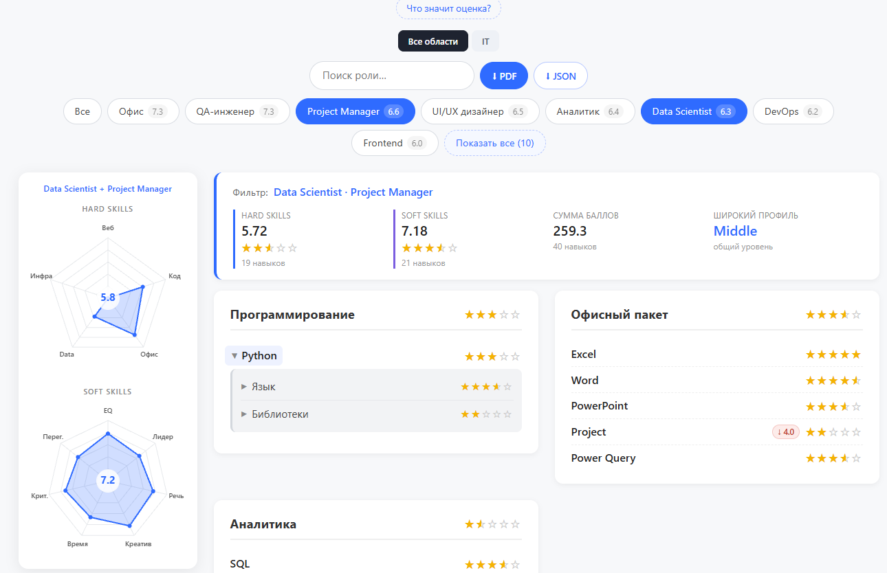

# Персональный сайт с навыками

Сайт расположен в папке src/
ES-модули запускаются через варианты:

1. через - Python
```cmd
cd project/
python -m http.server 8000
```
2. через Node.js
```bash
cd project
npx serve
```
3. через VS Code Live Server:
Установить расширение Live Server, правый клик по index.html -> Open with Live Server.

Пример отображения:
